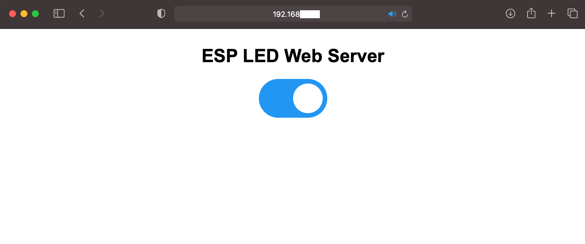

# micropython wifi sample code for ESP8266

Sample code for connecting to a WiFi network using the ESP8266 module and blink the LED.

Just update the ssid and password, load files onto the board and hit reset 👍

👏 All code is based on the [great tutorial here](https://randomnerdtutorials.com/micropython-relay-module-esp32-esp8266/) for the esp32 or esp8266 and relays. 

## Firmware

[micropython esp8266](https://micropython.org/download/esp8266/) use thonny to upload the firmware.